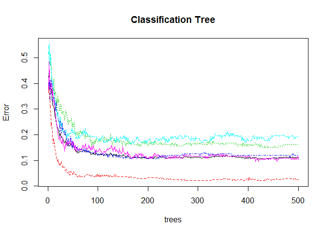

#  Predict the Quality of Weight Lifting with Machine Learning

##Synopsis
The goal of this project is to use data from accelerometers on the belt, forearm, arm, and dumbell of 6 participants to predict of the quality of their weight lifting form. We applied random forest tree algorithsm, and achieved an out-of-sample error rate of 10%.

Source of the dataset: Velloso, E.; Bulling, A.; Gellersen, H.; Ugulino, W.; Fuks, H. Qualitative Activity Recognition of Weight Lifting Exercises. Proceedings of 4th International Conference in Cooperation with SIGCHI (Augmented Human '13) . Stuttgart, Germany: ACM SIGCHI, 2013. 


```r
library(plyr)
library(dplyr)
```

```
## 
## Attaching package: 'dplyr'
## 
## The following objects are masked from 'package:plyr':
## 
##     arrange, count, desc, failwith, id, mutate, rename, summarise,
##     summarize
## 
## The following object is masked from 'package:stats':
## 
##     filter
## 
## The following objects are masked from 'package:base':
## 
##     intersect, setdiff, setequal, union
```

```r
library(caret)
```

```
## Loading required package: lattice
## Loading required package: ggplot2
```

```r
library(ggplot2)
```
##Data Loading and Cleaning

Data are read from csv file into a dataframe. In the quiz data (20 cases), some columns have many NA values, and thus cannot be used to build prediction model. We eliminated those columns. Additonally, we eliminated all the columns that are not data on weight lifting except user_name and num, which are needed for futher processing. 


```r
training<-read.csv("pml-training.csv", header=TRUE) #read training data
quizdata<-read.csv("pml-testing.csv", header=TRUE) # read quiz data

# Retain columns that are not NA in the quiz dataset
col_complete<-!is.na(quizdata[1,])
training<-training[,col_complete]
quizdata<-quizdata[,col_complete]


# Also remove columns 1 and 3:6 because these are not relavant to weight lifting.
training<-training[,-c(1,3:6)]
quizdata<-quizdata[,-c(1,3:6)]
```

##Data Patition and Processing
In order to build the model. We first partitioned the data into two sets, 85% as training data and 15% as testing data for cross validation purpose. For each time window, we calculated the averages for all the column except "classe","user_name", and "num_window". After this step, user_name and num_window columns are removed. In the end, the data contains only  "classe" column and the columns are related to weight lifting, and each row is the average data for one time window.


```r
# Separate into training and testing data set.
inTrain <- createDataPartition(y=training$num_window, p=0.85, list=FALSE)
trn_in_training <- training[inTrain,]
tst_in_training <- training[-inTrain,]

# Calculate mean for all columns foreach num_window.
train_usr_win_mean <- ddply(trn_in_training, .(user_name, num_window, classe), numcolwise(mean))

# Further remove columns user_name and num_window.
trn_train_usr_win_mean<-train_usr_win_mean[,-(1:2)]
tst_train_usr_win_mean<-tst_in_training[,-(1:2)]
quizdata<-quizdata[,-(1:2)]
```
##Model building
We applied random forest algorithsm to predict the "classe" variable. We chose random forest because it is a fairly accurate algorishm for classification problem


```r
modFit<-train(classe ~ ., data=trn_train_usr_win_mean,method="rf",trControl=trainControl(method="cv",number=5),prox=TRUE,allowParallel=TRUE)
```

```
## Loading required package: randomForest
## randomForest 4.6-10
## Type rfNews() to see new features/changes/bug fixes.
```

```r
modFit
```

```
## Random Forest 
## 
## 857 samples
##  52 predictor
##   5 classes: 'A', 'B', 'C', 'D', 'E' 
## 
## No pre-processing
## Resampling: Cross-Validated (5 fold) 
## 
## Summary of sample sizes: 685, 687, 685, 685, 686 
## 
## Resampling results across tuning parameters:
## 
##   mtry  Accuracy   Kappa      Accuracy SD  Kappa SD  
##    2    0.8809242  0.8488734  0.02558177   0.03260022
##   27    0.8750760  0.8413337  0.03088986   0.03944173
##   52    0.8762728  0.8429196  0.03647911   0.04655178
## 
## Accuracy was used to select the optimal model using  the largest value.
## The final value used for the model was mtry = 2.
```


```r
plot(modFit$finalModel,main="Classification Tree")
```

 

## Cross Validation
We then applied the model to the testing data to conduct cross validation. the confusionMatrix is as follows. The out of sample accuracy rate is expected to be 0.91. The relationship between number of trees and error rates are plotted.


```r
confusionMatrix(tst_train_usr_win_mean$classe,predict(modFit,tst_train_usr_win_mean[,-53]))
```

```
## Confusion Matrix and Statistics
## 
##           Reference
## Prediction   A   B   C   D   E
##          A 773  11   9  17   6
##          B  43 462  45   5   7
##          C  11  28 471   7   4
##          D   5   5  39 422   8
##          E   3  10  12   6 532
## 
## Overall Statistics
##                                           
##                Accuracy : 0.9045          
##                  95% CI : (0.8933, 0.9148)
##     No Information Rate : 0.2839          
##     P-Value [Acc > NIR] : < 2.2e-16       
##                                           
##                   Kappa : 0.8793          
##  Mcnemar's Test P-Value : 9.662e-09       
## 
## Statistics by Class:
## 
##                      Class: A Class: B Class: C Class: D Class: E
## Sensitivity            0.9257   0.8953   0.8177   0.9234   0.9551
## Specificity            0.9796   0.9588   0.9789   0.9771   0.9870
## Pos Pred Value         0.9473   0.8221   0.9040   0.8810   0.9449
## Neg Pred Value         0.9708   0.9773   0.9566   0.9858   0.9895
## Prevalence             0.2839   0.1755   0.1959   0.1554   0.1894
## Detection Rate         0.2628   0.1571   0.1601   0.1435   0.1809
## Detection Prevalence   0.2775   0.1911   0.1772   0.1629   0.1914
## Balanced Accuracy      0.9527   0.9271   0.8983   0.9502   0.9711
```

## Prediction


```r
# Prediction on real testing data set.
final_results<-predict(modFit,quizdata[,-53])
final_results
```

```
##  [1] B A A A A E D B A A A C B A E E A B B B
## Levels: A B C D E
```
